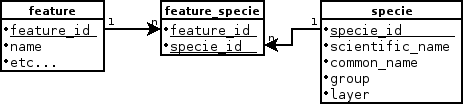
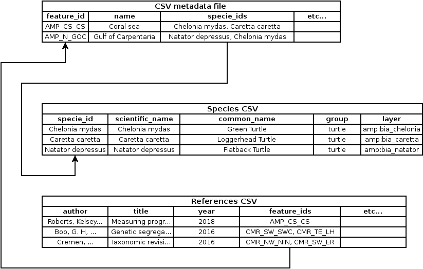

# Configuration #

Configure the module with ```https://eatlas.org.au/admin/config/eatlas/eatlas_spatial_publisher```

Click the *Add a Spatial Publisher site* link to create a new navigation map.

* **Name**: Name of the navigation map. That name is used internally for references
and for the root element of the navigation menu.
It will also be use for the name of the vocabulary root term that will be used for referencing nodes.
The name can be change later.

* **Region menus**: The module can create navigation menu items. Simply select to which menu the item needs to be added.
The menu item will have the weight index 0. You can control where it appear in the menu by changing the index
of the other elements of the menu.

* **Max zoom level**: Restrict the navigation map to a maximum zoom level.

* **North, East, South, West**: Define the initial bounding box of the navigation map.
OpenLayers will decide the most appropriate "center" and "zoom level" for the specified bounding box.
If no bounding box is specified (or one value is missing), the module will use the combine bounding box
of all the features of the provided GeoJSON file (see next step).

Once the navigation map is created, click the edit button next to it.


## Region sets ##

Click on *Add a region set* to associate a GeoJSON with the navigation map.
This will open the *Create eAtlas Region set* page, which will create an instance of the content type *Region set*.<br/>
See [Content type ```eatlas_publisher_region_set```](content-type-region-set.md) for more info.

* **Title**: Node title, display on the map side panel when no feature is selected.

* **Preview image**: Image displayed in the header of the map side panel when no feature is selected.

* **Introduction article**: Page content displayed in the map side panel when no feature is selected.

* **GeoJSON file**: File containing the polygon to display on the map.<br/>
    See [GeoJSON and CSV file](geojson-csv-file.md).

* **ID column name**: Name of the GeoJSON property or CSV column to use as an ID for the features.
    The ID is used in the URL, for the creation of taxonomy terms to refer nodes, etc.
    It is in your best interest to set this field correctly on creation of the node.
    Modifying this field will generate a lot of issues:
    * New taxonomy terms will be created, to reflect the value of the new column specified
    * Nodes associated with the old taxonomy terms will not get migrated to the new taxonomy term.
        The migration needs to be done manually.
    * Old taxonomy terms will remain in the system, with the label suffix *TO DELETE*.

* **Parent ID column name**: Name of the GeoJSON property or CSV column containing the ID of the parent feature.
    This is used for navigation map which has multiple level of navigation.
    The first level do not have parent. The column needs to stay empty.
    The second navigation level is created using another region set node.
    The value found on the column set here needs to match the values found in the
    *ID column name* of the parent node (described at the end of this list).

* **Label column name**: Name of the GeoJSON property or CSV column containing the value to use as a label
    when referring to the feature. This is used for the generation of the navigation menu.

* **CSV metadata file**: CSV file, used to add supplementary information to the features.
    Modifying the GeoJSON can be complicated. You need appropriate tools and it generally
    takes longer than modifying a CSV file.
    The purpose of this CSV file is to make it easier to maintain certain properties of the features.<br/>
    See [GeoJSON and CSV file](geojson-csv-file.md).

* **Template**: PHP template used to show information about the selected feature.<br/>
    See [Template](template.md)

* **Map Base layer**: JavaScript code used to instanciate an OpenLayers *ol.layer*.<br/>
    Example:
    ```
    new ol.layer.Tile({
      source: new ol.source.TileWMS({
        attributions: 'Basemap: <a href="..." target="_blank">Bright earth</a>',
        url: 'https://maps.eatlas.org.au/maps/gwc/service/wms',
        crossOrigin: 'anonymous',
        params: {
          'LAYERS': 'ea-be:World_Bright-Earth_MPA-basemap',
          'FORMAT': 'image/jpeg',
          'TRANSPARENT': false,
          'VERSION': '1.1.1',
          'TILED': true
        },
        hidpi: false,
        serverType: 'geoserver'
      })
    })
    ```

* **Style**: JavaScript code used to create a single or an array of OpenLayers *ol.style*.
    The style is used to display the GeoJSON feature when it's not selected.<br/>
    Properties from the GeoJSON and CSV file can be used here:

    * ```feature.get(PROPERTY_NAME)```

        Get a property from the GeoJSON or CSV, for the selected feature.

        * **Parameters**

            * ```PROPERTY_NAME```: *String* (mandatory). Name of the GeoJSON property or CSV column.

        * **Return value**

            *String*. The value for the specified property or CSV column, for the selected feature.

    * ```getAlphaColour(HEXADECIMAL_COLOR, OPACITY)```

        The function *getAlphaColour* can also be used to change the opacity of an hexadecimal colour:

        * **Parameters**

            * ```HEXADECIMAL_COLOR```: *String* (mandatory). Hexadecimal colour. Example: *#FF3399*

            * ```OPACITY```: *Decimal* (mandatory). 1 for full opacity, 0 for transparent.

        * **Return value**

            *Array of decimal*. Representation of the colour as an array of decimal value, between 0 and 1;
            [Red, Green, Blue, Alpha]

    **Example**
    ```
    new ol.style.Style({
        'stroke': new ol.style.Stroke({
            'color': feature.get('colour'),
            'width': 1,
        }),
        'fill': new ol.style.Fill({
           'color': getAlphaColour(feature.get('colour'), 0.5)
        })
    })
    ```

* **Mouse over style**: JavaScript code used to create a single or an array of OpenLayers *ol.style*.
    The style is used to display the GeoJSON feature when the mouse move over it.<br/>
    See *Style* above for more information.

* **Selected style**: JavaScript code used to create a single or an array of OpenLayers *ol.style*.
    The style is used to display the GeoJSON feature that is selected.<br/>
    See *Style* above for more information.

* **Site**: The navigation map associate with this *Region set* node.
    The appropriate value should already be selected.
    You should not have to modify this value.

* **Parent**: The ID of the parent node. This field is required for the second level of the navigation map, and up.<br/>
    *NOTE*: This field should display a dropdown of node, but that functionality has not been implemented yet.


## Supplementary CSV files ##

The GeoJSON / CSV file solution do not allow data to be stored like in a relational database.

For example, let say we want to store a list of species found in each regions (represented by features on the navigation map).

Each species have the following attributes:
* *specie_ID*: A unique ID for the specie
* *scientific_name*: Specie latin name
* *common_name*: Specie common English name
* *group*: Which group it belong to; dolphin, turtle, sea bird, etc
* *layer*: Specie distribution layer

Each species can occur in multiple regions.

### Relational database analogy ###

With a relational database, we would create a schema like this one:



### Solution using CSV ###

When using CSV files, we have to be more creative. We solve this problem in 2 different ways.

Lets illustrate the solutions using the variable **species** and the variable **references**.

**NOTE**: The following examples has been simplified for clarity.



#### For the **species** ####

* We added a specie_ids column to our *CSV metadata file*.
    The column contains a list of specie IDs, separated by coma.
* We created a new specie CSV file. Each row contains the information for one specie.
* We upload the specie CSV file as a *supplementary CSV file*. We name the file's variable: *species*.
* We added methods to the template context to help extract the relevant information.
    See [Template](template.md) method **getCSVCell**.

In the template, we can find the relevant species for each region like this:

```
<?php
// Get the column "specie_ids" from the "CSV metadata file" file, for the selected feature
$specie_ids_str = $c->get("specie_ids");
$specie_ids = explode(',', $specie_ids_str);
foreach ($specie_ids as $specie_id) {
    // Find the common name of the current specie by looking in the column "common_name" of the variable "species",
    // where the column "specie_id" match the current specie ID ($specie_id).
    // NOTE: The method "getCSVCell", and other similar method, trim the input parameters to remove trailling spaces.
    //             $c->getCSVCell($variable, $key_column, $value,     $column_name,  $default_value)
    $common_name = $c->getCSVCell('species', 'specie_id', $specie_id, 'common_name', 'No name');
    ...
}
?>
```

#### For the **references** ####

* We didn't modify our *CSV metadata file*.
* We created a new references CSV file. Each row contains the information for one reference. Each row also have a
    column *feature_ids* containing the list of the ID of all relevant feature.
* We upload the reference CSV file as a *supplementary CSV file*. We name the file's variable: *references*.
* We added methods to the template context to help extract the relevant information.
    See [Template](template.md) method **getCSVRowsMultiValueCell**.

In the template, we can find the relevant references for each region like this:

```
<?php
//                $c->getCSVRowsMultiValueCell($variable,    $key_column,   $value,                $delimiter)
$reference_rows = $c->getCSVRowsMultiValueCell('references', 'feature_ids', $c->get("feature_id"));
foreach ($reference_rows as $reference_row) {
    $author = $reference_row['author'];
    ...
}
?>
```
