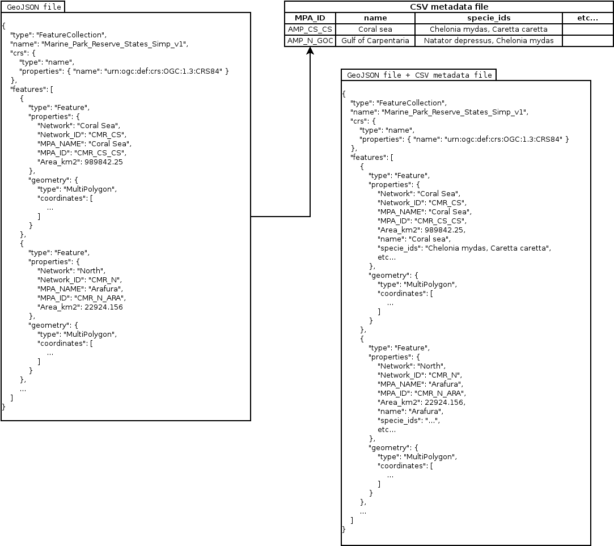
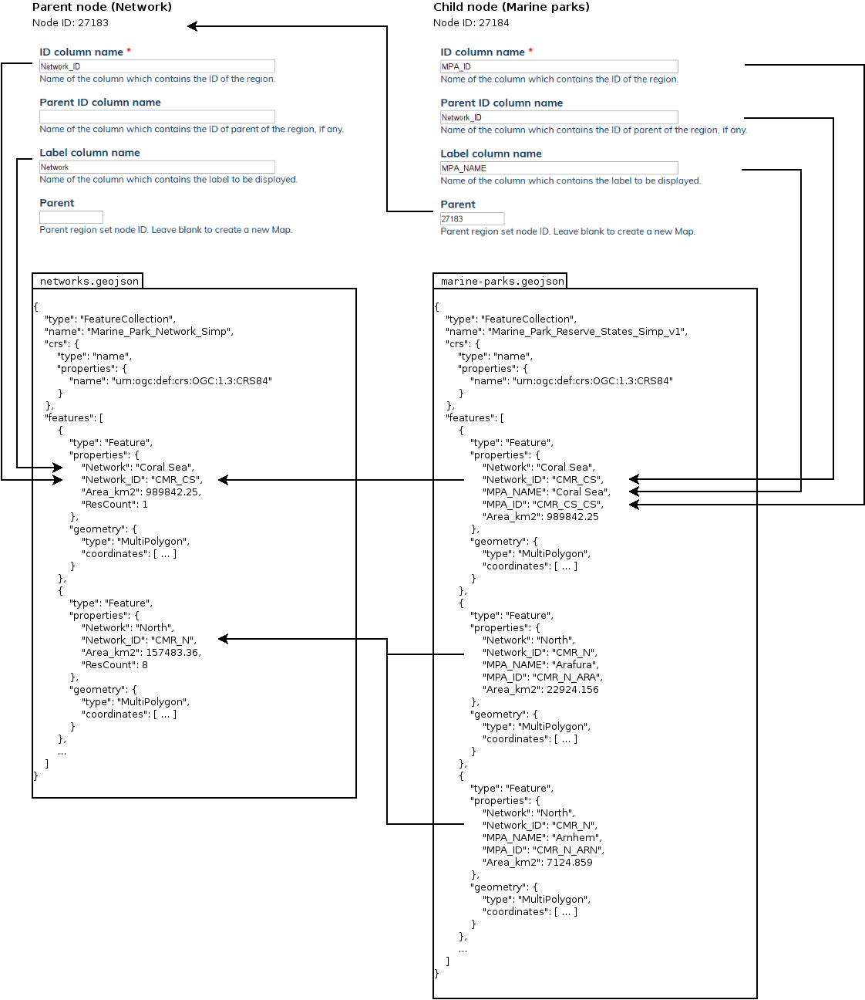

# GeoJSON and CSV file #

In theory, the system only need a GeoJSON file. In practice, modifying a GeoJSON file is not convenient,
so it's better to combine the GeoJSON file with something easier to maintain.

The solution is to use CSV to attach extra information (properties) to the GeoJSON features.

The GeoJSON file and the CSV file are uploaded into the system. The files are combined in memory, then used
in the OpenLayers navigation map, the *template* field and the 3 *style* fields of the **eAtlas Region set** node.



## Special columns ##

Some columns have special meaning in the Drupal module,

* ```menu_ignore```: *String* (optional). Accepted values:
    * ```''```: (empty string) Normal behaviour.
    * ```'TRUE'```: The feature is not present in the navigation menu, but is still visible on the map,
        bellow elements which do not have *menu_ignore* set to *'TRUE'*.

    **NOTE**: Any other value will be interpreted as *'TRUE'*.

## GeoJSON file ##

You can create / modify the GeoJSON using most GIS software; ArcMap, QGis, etc.

If you look at the content of the GeoJSON, you should see:

* The GeoJSON have a list of feature, stored in an array, at the root of the GeoJSON.
    The key of the array should be **features**.
* Each feature have a list of properties, stored in an object, The key of the object should be **properties**.
* Choose one of those property for your ID. The ID needs to be unique for each feature.
    The name of that property needs to be set in the field **ID column name** for the **eAtlas Region set** node.
    For this example, we have chosen the property *MPA_ID*.
* The tree structure is defined using the **Parent ID column name** field. That field can reside in either
    the *GeoJSON file* or the *CSV metadata file*. Each values for that field should match a value for the
    **ID column name** of the parent **eAtlas Region set** node. The node ID of the parent node must be specified
    in the **Parent** field of the **eAtlas Region set** node. See diagram bellow.

**NOTE**: Only relevant fields of the **eAtlas Region set** nodes are shown, for simplicity.



**IMPORTANT** Avoid GeoJSON property's name starting with an underscore "_". Those are reserved by the Drupal module.

## CSV metadata file ##

You can create / modify the CSV file using most spreadsheet software.
**Avoid using Microsoft Excel for Macintosh**,
it has tendency of generating broken CSV files that even itself can't open.
See *WARNING - CSV files and Microsoft Excel* section bellow for better explanation.

* The CSV file MUST contains a column with the exact same name as the GeoJSON ID column,
    as noted in the field **ID column name** of the **eAtlas Region set** node.
    For this example, we are using *MPA_ID*.
* Every other named columns present in the CSV file get copied to the GeoJSON properties list.<br/>
    **NOTE**: Only the internal *in memory* GeoJSON is modified. The GeoJSON file on disk stays untouched.

**IMPORTANT** Avoid CSV column's name starting with an underscore "_". Those are reserved by the Drupal module.

### WARNING - CSV files and *Microsoft Excel* ###

CSV files have no [established standards](https://en.wikipedia.org/wiki/Comma-separated_values#Standardization).
In theory, the files should use *comma* as field separator
and *double quote* as string delimiter. In practice, we see a large variety of loosely define standards
using *tab* as field delimiter or other characters. To simplify the problem,
the system expect *comma* as field separator and *double quote* as string delimiter, as defined by
[RFC 4810](https://tools.ietf.org/html/rfc4180).

**Microsoft Excel for Macintosh** sometime behave very oddly. Some people will say that this software
is **completely broken and should never be used**. In some cases, when saving a spreadsheet as a CSV file,
*Microsoft Excel* for *Macintosh* will randomly add several unreasonable *double quotes* in the document,
making it impossible to parse with any software including itself, and making it nearly impossible to fix manually.

The main problem with CSV files is character encoding. Some software, such as *Microsoft Excel* for *Windows*,
will save the CSV as *[Windows-1252](https://en.wikipedia.org/wiki/Windows-1252)* encoding.
*Microsoft Excel* for *Macintosh* used the very old and deprecated
*[Mac OS Roman](https://en.wikipedia.org/wiki/Mac_OS_Roman)* encoding,
which haven't been used by Macintosh itself since
*[Macintosh classic](https://en.wikipedia.org/wiki/Classic_Mac_OS)*, in 2001.
Other software save CSV files as *[UTF-8](https://en.wikipedia.org/wiki/UTF-8)*
or simply *[ASCII](https://en.wikipedia.org/wiki/ASCII)*.

You can't expect *Microsoft Excel* to output only *ASCII* characters when exporting as CSV file.
When typing even the most simple and strait forward English text, *Microsoft Excel* automatically
convert some characters to fancy equivalence such as *hyphen* to *EN Dash* or *EM Dash*,
*single quote* and *double quote* to *smart quote*, etc. Even when you deactivate all
automatic character conversions, the problem still occur when text is copied from
*Microsoft Word* (or pretty much anywhere for that matter) to *Microsoft Excel*.

You would think that converting the CSV file to *UTF-8* would fix the problem,
but unfortunately, *Microsoft Excel* still find unexpected ways to mess up. When it loads a *UTF-8* CSV file,
everything is fine. Characters are displayed correctly in *Ms Excel*. If the user modifying the file by adding only
ASCII characters and save the file, everything is still fine. The resulting file is encoded in *UTF-8*. If the user
add none ASCII characters, by copy / pasting or automatic conversion by *Ms Excel*, then save the file,
the resulting file is a miss match of encoding that no known software can read, including *Ms Excel* itself.

The only viable solution is to convert every CSV file to ASCII. It's a very small subset of UTF-8, so
most characters get lost in the conversion.

#### Converting CSV files to ASCII ####

The Drupal module support 4 encodings for CSV files:
* *ASCII*
* *Windows-1252*
* *Mac OS Roman*
* *UTF-8*

The loading process works as follow:

1. There is nothing in the CSV file to tell which encoding is used. The Drupal module needs to play a
    guessing game at loading time:
    1. *ASCII* is very strait forward. If all characters are in the *ASCII* character range,
        the file encoding is *ASCII*.
    2. *UTF-8* is somewhat easy to detect as well. If we find a combination of character that
        isn't *UTF-8* valid, the file encoding is not *UTF-8*.
    3. The main issue is distinguishing between *Windows-1252* and *Mac OS Roman*.
        Both encodings use the same code for different character. The module achieve this
        by looking at the number of occurrences of most commonly used characters for both encoding,
        such as *EN Dash*, *EM Dash*, *smart quotes*, etc. Then it uses basic statistics to determine
        which one of the 2 encodings is the most probable.

2. The Drupal module convert everything to *UTF-8* in order to start from a common base.

3. It convert *UTF-8* to *ASCII* by modifying commonly used characters to acceptable *ASCII* counterparts.
    Other characters are simply converted to question marks *?*.

4. Finally, it overwrites the uploaded file with the converted *ASCII* file. The system do not keep the
    original uploaded file. If it's not *ASCII*, it's likely to cause issues, therefor it's not worth keeping.

**NOTE**: Since the uploaded file is converted to *ASCII*, it can be download and modified using any spreadsheet
    software from any operating system without issue. As long as the modified CSV file is in one of the supported
    character encodings, it can be re-uploaded into the system.
