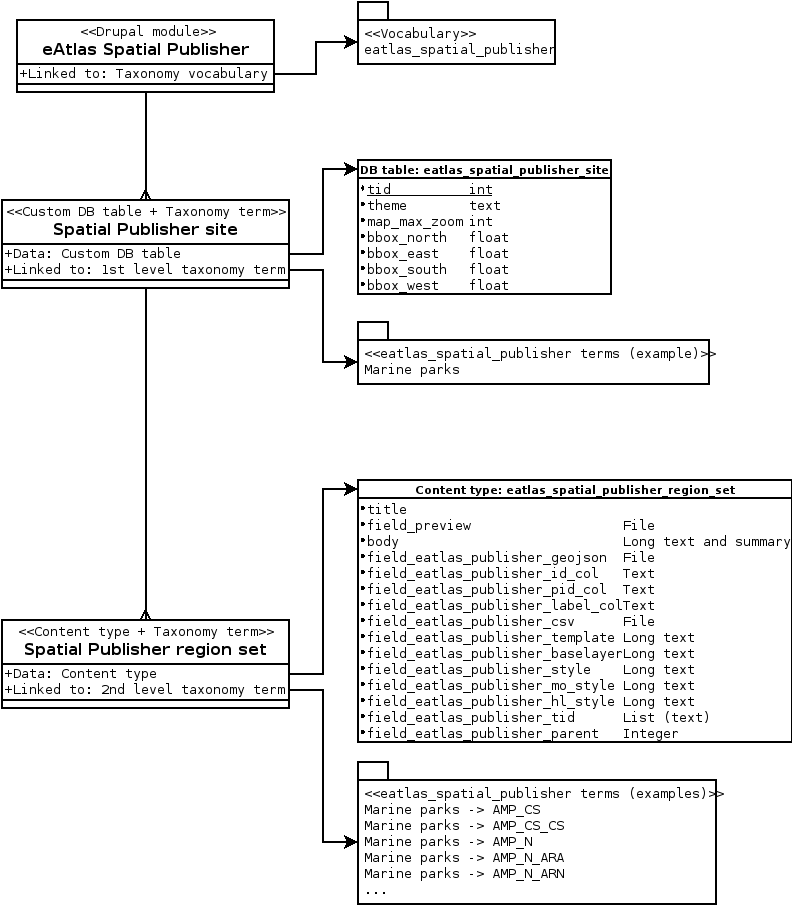

# Overview #

[eAtlas Spatial Publisher module configuration page](https://eatlas.org.au/admin/config/eatlas/eatlas_spatial_publisher)

The module is tightly bind to the taxonomy module,
to allow easy tagging of nodes to the appropriate region.

The information about the *spatial publisher sites* (navigation map) are saved
in the custom database table *eatlas_spatial_publisher_site*.

Each site have one or more *region sets*, which are managed by the content type
*eatlas_spatial_publisher_region_set*. The content type is automatically
created by this Drupal module.

## Spatial Publisher site ##

When a new *Spatial Publisher site* is created,
a new 1st level taxonomy term is created in the vocabulary *eatlas_spatial_publisher*,
and a new entry is added to the database table *eatlas_spatial_publisher_site*.

## Spatial Publisher region set ##

When a *GeoJSON file* is uploaded to a *Spatial Publisher site*:
* The file is parsed to extract the regions' ID and label
* For each region extracted from the *GeoJSON file*, a 2nd level
    taxonomy term is created under the site's 1st level taxonomy term

